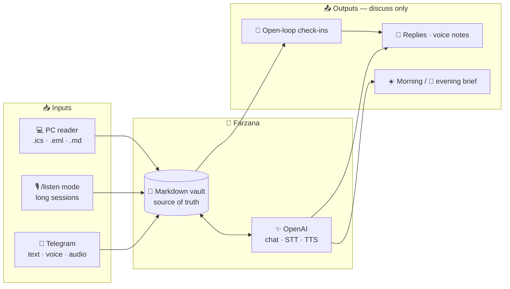
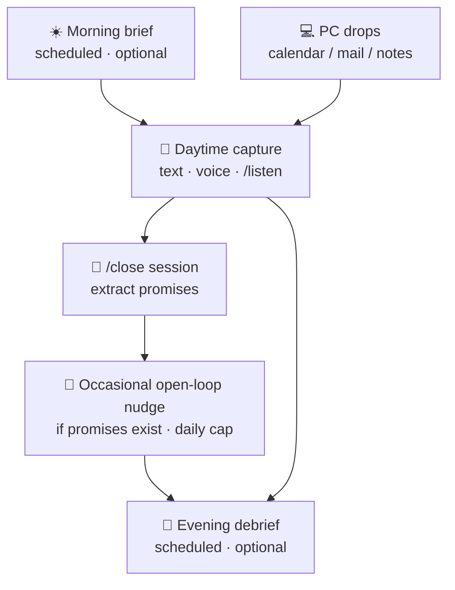
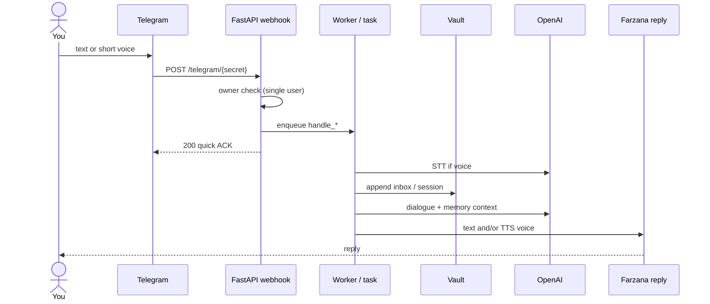
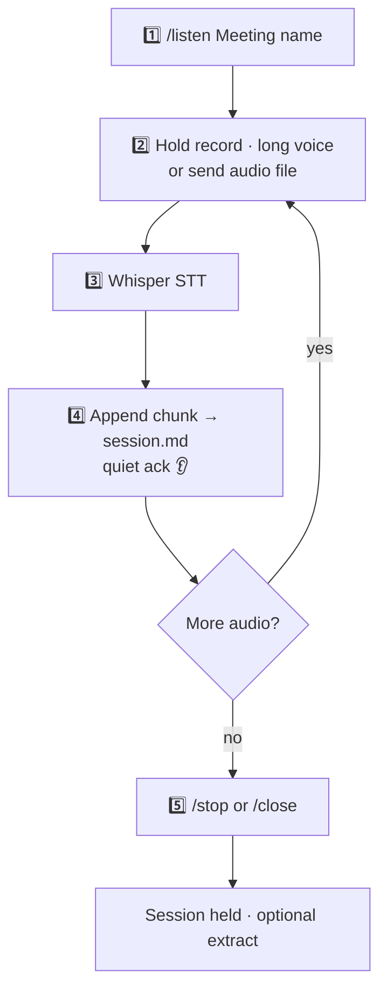
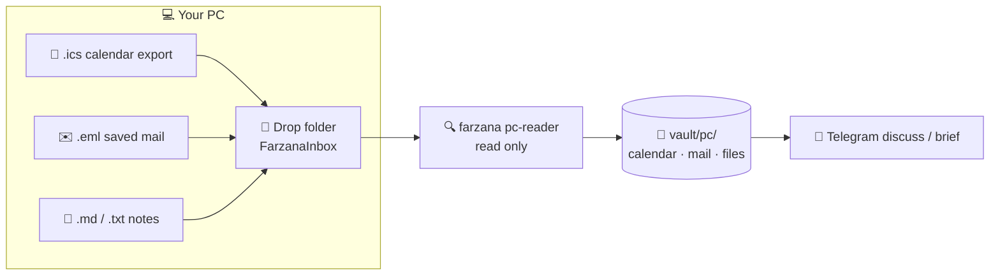
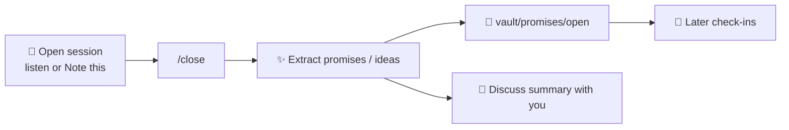
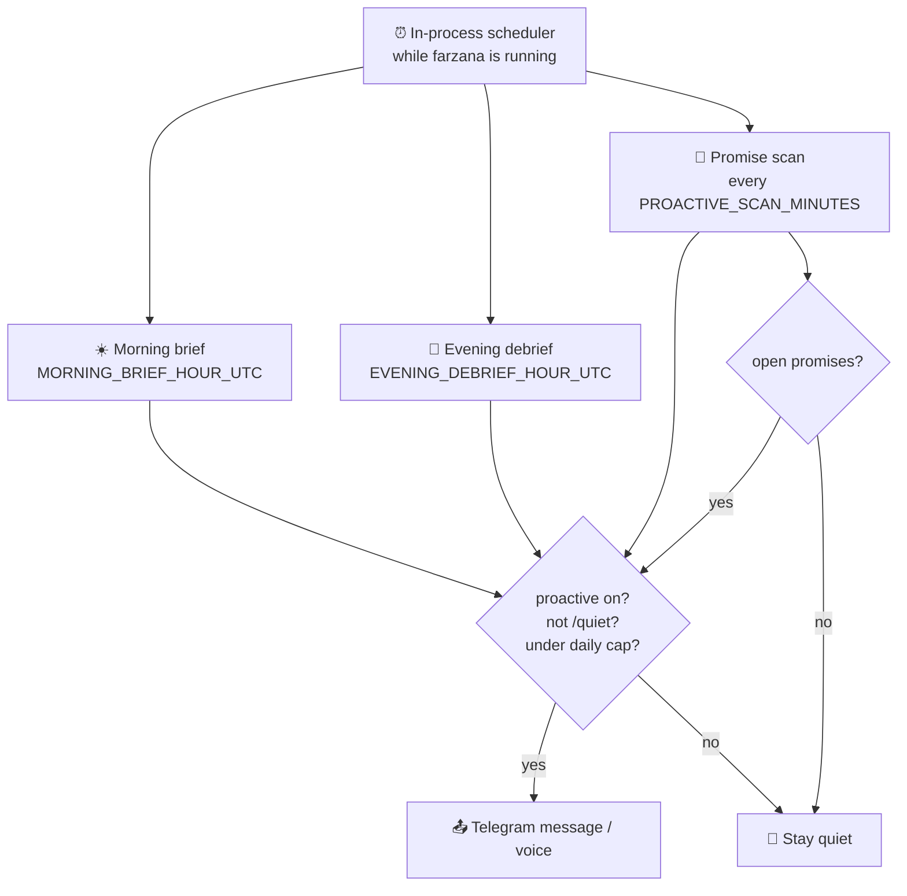
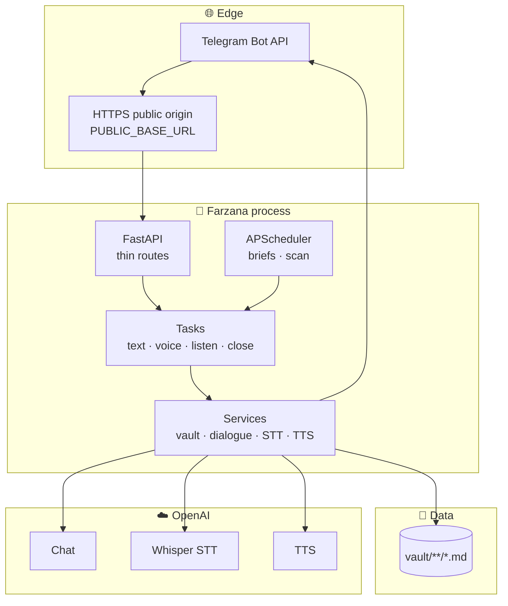
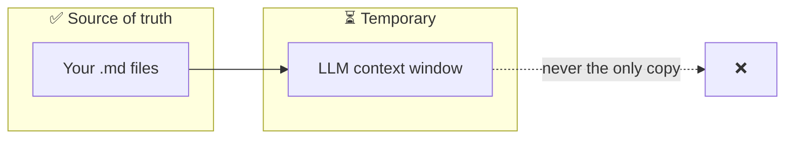
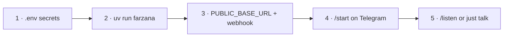

# Farzana

**The aide who listens carefully.**

[](LICENSE)
[](https://www.python.org/)
[](docs/STACK.md)
[](docs/RULES.md)

> **Capture → Vault → Discuss / Remind**  
> Never send email · never book calendar · never act for you.

Farzana is a **single-user, read-only Markdown memory aide** on Telegram.  
She holds the thread of your day — long voice, short notes, and (optionally) PC exports you allow her to **read** — then talks with you gently when it matters.

| She is | She is not |
|:-------|:-----------|
| A careful listener | An action agent (OpenClaw / Hermes) |
| Your Markdown memory | A hardware stenographer (Pocket) |
| A discreet resurfacer | A romantic / therapist companion |

---

## Table of contents

- [Big picture](#-big-picture)
- [How a day flows](#-how-a-day-flows)
- [Flow 1 · Everyday chat](#-flow-1--everyday-chat)
- [Flow 2 · Telegram as Pocket (`/listen`)](#-flow-2--telegram-as-pocket-listen)
- [Flow 3 · PC essentials (read-only)](#-flow-3--pc-essentials-read-only)
- [Flow 4 · Close, extract, discuss](#-flow-4--close-extract-discuss)
- [Flow 5 · Remind & check-in](#-flow-5--remind--check-in)
- [System map](#-system-map)
- [Vault layout](#-vault-layout--memory-is-files)
- [Commands](#-commands-cheat-sheet)
- [Quick start](#-quick-start)
- [Motivation & name](#-motivation--name)
- [Docs](#-docs)

---

## Big picture



```text
   LISTEN + READ  ──►  VAULT  ──►  REMIND · ADAPT · GENTLE DISCUSS
                         │
                         └── never write email / book / browse / shell
```

---

## How a day flows



| Time | What happens | You control |
|:-----|:-------------|:------------|
| ☀️ Morning | Short brief from vault + open promises | Hours in env (UTC); `/quiet` stops all |
| 💬 Day | Chat, long `/listen`, PC imports | You start / stop capture |
| 📎 Close | `/close` → promises landed in vault | You decide when to close |
| 🔔 Check-in | May resurface **one** open loop | Max ~3 proactive msgs/day |
| 🌙 Evening | Gentle debrief of what was held | Same caps / quiet rules |

> Honest limits: **adapt** today means grounded memory + quiet mode, not full ML “learns your patterns yet.”  
> **Remind** is open-loop resurfacing + briefs — not a full calendar alarm engine.

---

## Flow 1 · Everyday chat



**In plain words**

1. Only **your** Telegram user id is allowed.  
2. Message is saved into **Markdown you own**.  
3. Reply is grounded in recent vault context.  
4. Optional **voice out** (TTS) when enabled.

---

## Flow 2 · Telegram as Pocket (`/listen`)

Telegram bots **cannot** hold a secret always-on mic.  
Farzana does the practical equivalent: **long sessions** of voice/audio chunks.



| Step | You | Farzana |
|:-----|:----|:--------|
| Start | `/listen Standup` | Opens / continues a named session |
| Speak | Long Telegram voice notes (many clips OK) | Transcribes · **appends** · short ack |
| Pause | Keep sending clips anytime | Same session grows |
| End | `/stop` or `/close` | Leaves listen mode; `/close` extracts promises |

```text
/listen Design review
   🎤 clip 1  →  heard chunk 1
   🎤 clip 2  →  heard chunk 2
   🎤 clip 3  →  heard chunk 3
/close
   → summary + open promises in vault
```

📖 Detail: [docs/VISION_LISTEN_AND_PC.md](docs/VISION_LISTEN_AND_PC.md)

---

## Flow 3 · PC essentials (read-only)

Give Farzana **eyes on the PC**, never **hands**.



| Drop | Lands in | Write-back? |
|:-----|:---------|:------------|
| `.ics` | `vault/pc/calendar/` | ❌ never books |
| `.eml` | `vault/pc/mail/` | ❌ never sends |
| `.md` / `.txt` | `vault/pc/files/` | ❌ only vault copy |

```bash
mkdir FarzanaInbox
# export calendar → .ics, save mail → .eml, drop notes → .md

uv run farzana pc-reader --watch ./FarzanaInbox --once
# or keep watching:
uv run farzana pc-reader --watch ./FarzanaInbox
```

If the bot runs on a server, run the reader where the vault lives — or **sync** `vault/pc/` (e.g. Syncthing).

---

## Flow 4 · Close, extract, discuss



| Command | Effect |
|:--------|:-------|
| `Note this: project-x` | Open / continue a session |
| `/listen project-x` | Same, optimized for long audio |
| `/close` or `/close project-x` | Close session · extract · discuss |
| `/stop` | Leave listen mode only (no extract) |

---

## Flow 5 · Remind & check-in



| Behavior | Reality today |
|:---------|:--------------|
| End-of-day discuss | ✅ Evening brief job (UTC hour) |
| Occasional “still open?” | ✅ One open promise at a time |
| Daily spam protection | ✅ Default max **3** proactive / day |
| Full task-manager nagging | ❌ Not a todo app |
| True pattern learning | ⏳ Logged events; evolve later |

Manual anytime: **`/brief`** · silence: **`/quiet`**

---

## System map



| Layer | Role |
|:------|:-----|
| `api/` | Webhook only — authz, enqueue, fast 200 |
| `workers/` | Message handling, listen, proactive tasks |
| `services/` | Vault, dialogue, STT/TTS, Telegram client |
| `pc_reader/` | Local CLI — PC drops → vault |
| `core/` | Config, single-user security |

Local shortcut: `CELERY_TASK_ALWAYS_EAGER=true` runs jobs in-process (no Redis required).

---

## Vault layout · memory is files

```text
vault/
├── config/          identity, prefs, listen state
├── inbox/           daily capture stream
├── sessions/        named notes + /listen sessions
├── promises/
│   ├── open/        📌 resurfaced later
│   └── closed/
├── pc/
│   ├── calendar/    from .ics
│   ├── mail/        from .eml
│   └── files/       from .md / .txt
├── proactive/       why each outbound fired
└── patterns/        event log (future adapt)
```



You can open the vault in any editor. **Files win.**

---

## Commands cheat sheet

| Command | Icon | What it does |
|:--------|:----:|:-------------|
| `/start` | 👋 | Hello + how to use |
| `/help` | ❓ | Command list |
| `/listen [name]` | 🎙️ | Pocket-style long audio session |
| `/stop` | ⏹️ | Leave listen mode |
| `/close [name]` | 📎 | Close session · extract · discuss |
| `Note this: name` | 📝 | Open / continue a text session |
| `/brief` | 📋 | Manual brief now |
| `/quiet` | 🤫 | No proactive messages |
| `/voice on\|off` | 🔊 | Voice reply preference |

Plus free text or short voice anytime.

---

## Quick start

```bash
git clone https://github.com/maazbin/farzana.git
cd farzana
cp .env.example .env
# fill TELEGRAM_BOT_TOKEN, TELEGRAM_USER_ID, OPENAI_API_KEY
# never commit .env

uv sync
uv run farzana health
uv run farzana --no-webhook   # API → http://127.0.0.1:8000
```

**Wire Telegram**

1. Set `PUBLIC_BASE_URL` to any public HTTPS origin that reaches port `8000` (tunnel or VPS).  
2. `uv run farzana` **or** `uv run farzana webhook` after the API is up.  
3. Message the bot from the account matching `TELEGRAM_USER_ID` → `/start`.



| Guide | Link |
|:------|:-----|
| Full setup | [docs/SETUP.md](docs/SETUP.md) |
| Listen + PC vision | [docs/VISION_LISTEN_AND_PC.md](docs/VISION_LISTEN_AND_PC.md) |
| Deploy templates | [deploy/README.md](deploy/README.md) |

### Secrets

Never commit `.env`, `*.pem`, bot tokens, or API keys.  
Rotate anything that leaked. See [SECURITY.md](SECURITY.md).

---

## Motivation & name

### Why it exists

Built because **ADHD under leadership load** made cold todos and silent notes fail: spoken promises vanish, notes die in graveyards, and agents that “just act” are dangerous when attention is uneven.

ADHD was the **motivation** — not a diagnosis product. The same design helps anyone who loses the thread on a low-capacity day.

```text
Most tools:  assume you already run a system
Farzana:     holds the thread when the system fails
```

### Why “Farzana”

Named for **careful listening** in the public memory of **Ishtiaq Ahmed’s Inspector Jamshed** stories (Jamshed with Mehmood, Farooq, and Farzana) — present, sharp, holds the case thread.

```text
You are the inspector of your own day.
Farzana catches the thread.
You still decide. She never seizes the badge.
```

Independent open source — **not** affiliated with the franchise.  
→ [docs/INSPIRATION.md](docs/INSPIRATION.md) · [docs/STORY.md](docs/STORY.md)

---

## What she refuses

```text
❌ Send email          ❌ Book / change calendar
❌ Browse as an agent  ❌ Shell / code on your machine
❌ Multi-user open bot ❌ Always-on secret microphone
❌ Romance / therapist cosplay
```

Enforced by product rules and by **not implementing** forbidden tools — see [docs/RULES.md](docs/RULES.md).

---

## Docs

| Doc | Content |
|:----|:--------|
| [STORY.md](docs/STORY.md) | Product + origin |
| [INSPIRATION.md](docs/INSPIRATION.md) | Name & listening myth |
| [MOTIVATION.md](docs/MOTIVATION.md) | Why / when / when not |
| [ARCHITECTURE.md](docs/ARCHITECTURE.md) | Technical shape |
| [VISION_LISTEN_AND_PC.md](docs/VISION_LISTEN_AND_PC.md) | Pocket + PC flows |
| [RULES.md](docs/RULES.md) · [SECURITY.md](SECURITY.md) | Hard rules |
| [ROADMAP.md](docs/ROADMAP.md) | What’s next |

---

## Contributing

[CONTRIBUTING.md](CONTRIBUTING.md) · [CODE_OF_CONDUCT.md](CODE_OF_CONDUCT.md) · [AGENTS.md](AGENTS.md)

## License

[MIT](LICENSE)

---

*Started from ADHD under load — that was the motivation.*  
*Built so anyone who needs a thread held can climb.*
